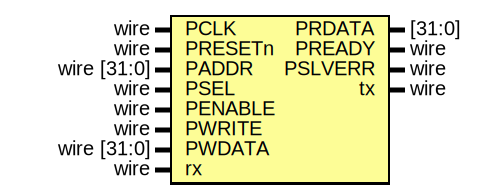

# Entity: apb_uart 
- **File**: apb_uart.v

## Diagram

## Ports

| Port name | Direction | Type        | Description |
| --------- | --------- | ----------- | ----------- |
| PCLK      | input     | wire        |             |
| PRESETn   | input     | wire        |             |
| PADDR     | input     | wire [31:0] |             |
| PSEL      | input     | wire        |             |
| PENABLE   | input     | wire        |             |
| PWRITE    | input     | wire        |             |
| PWDATA    | input     | wire [31:0] |             |
| PRDATA    | output    | [31:0]      |             |
| PREADY    | output    | wire        |             |
| PSLVERR   | output    | wire        |             |
| rx        | input     | wire        |             |
| tx        | output    | wire        |             |

## Signals

| Name                                    | Type       | Description |
| --------------------------------------- | ---------- | ----------- |
| rx_data_out                             | wire [7:0] |             |
| rx_done                                 | wire       |             |
| tx_data_in                              | wire [7:0] |             |
| tx_start                                | reg        |             |
| tx_active                               | wire       |             |
| rx_valid_flag                           | reg        |             |
| unused_rx_active                        | wire       |             |
| unused_tx_done                          | wire       |             |
| apb_write_req = PSEL & PENABLE & PWRITE | wire       |             |
| apb_read_req = PSEL & !PWRITE           | wire       |             |
| f_past_valid = 0                        | reg        |             |

## Processes
- unnamed: ( @(posedge PCLK or negedge PRESETn) )
  - **Type:** always
- unnamed: ( @(posedge PCLK or negedge PRESETn) )
  - **Type:** always
- unnamed: ( @(*) )
  - **Type:** always
- unnamed: ( @(posedge PCLK) )
  - **Type:** always

## Instantiations

- legacy_rx: uart_rx
- legacy_tx: uart_tx
