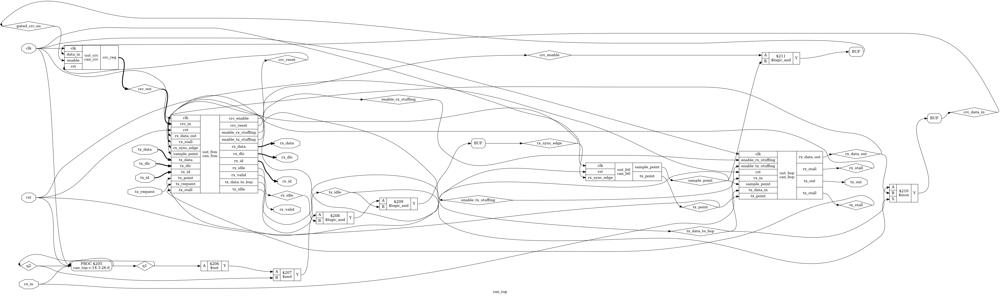
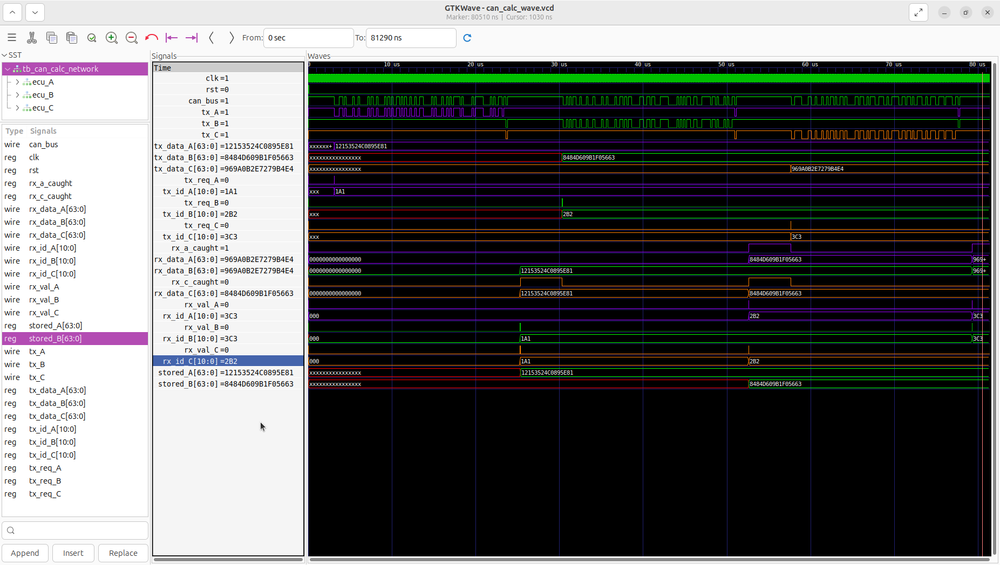
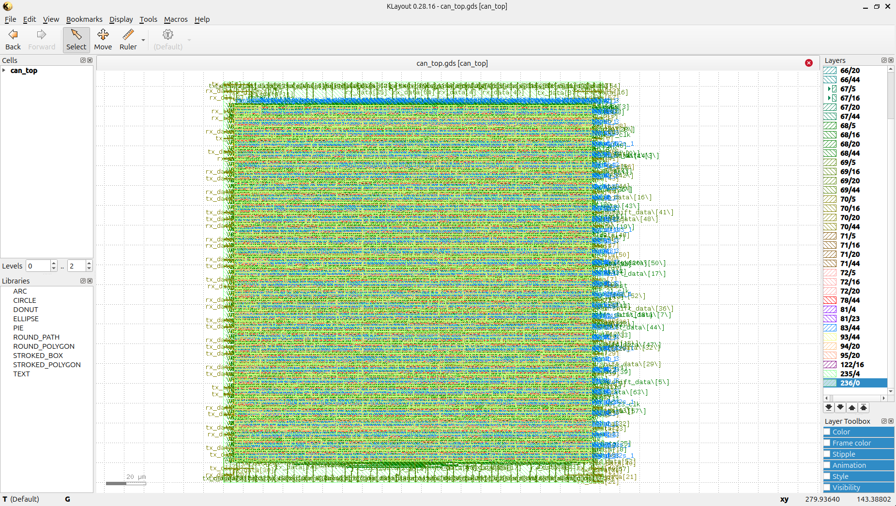
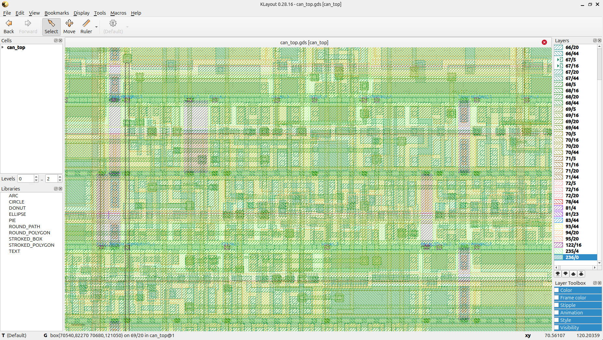

Silicon Portfolio: RTL-to-GDSII CAN 2.0 Bus Controller

Overview
This repository showcases the complete RTL-to-GDSII ASIC design flow for a cycle-accurate Controller Area Network (CAN 2.0) node. The project demonstrates full-stack hardware engineering, from behavioral Verilog design and distributed network verification to logic synthesis and physical silicon layout.

Core Achievements
* RTL Design: Designed a multi-module CAN node (FSM, Bit Stream Processor, CRC Calculator, Bit Timing Logic) in Verilog.
* Distributed Network Arbitration: Engineered and verified a multi-node testbench proving lossless bitwise arbitration across a shared bus.
* Continuous Integration: Implemented automated GitHub Actions (CI/CD) using Icarus Verilog to run regression tests on every commit.
* Logic Synthesis: Synthesized the behavioral RTL down to a gate-level netlist using Yosys, targeting standard cells.
* Physical Design: Executed the complete ASIC backend flow using OpenLane and the SkyWater 130nm PDK, successfully routing the design with zero setup/hold timing violations.

Hardware Architecture and Synthesis
The design was flattened and synthesized using Yosys. The resulting hardware architecture requires 1,963 total logic cells and 299 registers to manage the protocol state, bit stuffing, and error checking.

Functional Verification and CI/CD
The verification environment simulates a multi-node automotive network. The testbench proves that when multiple ECUs transmit simultaneously, the node with the lowest ID wins the bus without data corruption (CSMA/CD+AMP).

This project features a fully automated verification pipeline. On every push, GitHub Actions spins up an Ubuntu runner, installs Icarus Verilog, compiles the network, and asserts functional correctness.

Physical Design (SkyWater 130nm)
The synthesized netlist was hardened into a physical silicon layout (GDSII) using the OpenLane automated ASIC flow.

* Target Density: 0.55
* Clock Period: 20.0ns
* Routing: TritonRoute (Zero DRC violations, Zero Timing violations)

Silicon Layout (Macro View)

Standard Cell and Metal Routing (Micro View)

How to Run Locally

1. Functional Simulation
Ensure iverilog is installed, then run:
cd can_bus
make

2. Logic Synthesis
Ensure yosys is installed, then run:
cd can_bus
yosys synth.ys
