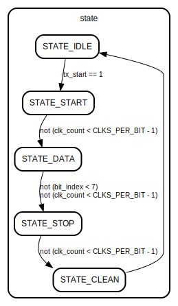

# Entity: uart_tx 
- **File**: uart_tx.v

## Diagram

## Generics

| Generic name | Type | Value    | Description |
| ------------ | ---- | -------- | ----------- |
| CLK_FREQ     |      | 50000000 |             |
| BAUD_RATE    |      | 9600     |             |

## Ports

| Port name | Direction | Type       | Description |
| --------- | --------- | ---------- | ----------- |
| clk       | input     | wire       |             |
| rst       | input     | wire       |             |
| tx_start  | input     | wire       |             |
| tx_data   | input     | wire [7:0] |             |
| tx_active | output    |            |             |
| tx_serial | output    |            |             |
| tx_done   | output    |            |             |

## Signals

| Name               | Type       | Description |
| ------------------ | ---------- | ----------- |
| state = STATE_IDLE | reg [2:0]  |             |
| clk_count = 0      | reg [15:0] |             |
| bit_index = 0      | reg [2:0]  |             |
| tx_buffer = 0      | reg [7:0]  |             |

## Constants

| Name         | Type | Value                | Description |
| ------------ | ---- | -------------------- | ----------- |
| CLKS_PER_BIT |      | CLK_FREQ / BAUD_RATE |             |
| STATE_IDLE   |      | 3'b000               |             |
| STATE_START  |      | 3'b001               |             |
| STATE_DATA   |      | 3'b010               |             |
| STATE_STOP   |      | 3'b011               |             |
| STATE_CLEAN  |      | 3'b100               |             |

## Processes
- unnamed: ( @(posedge clk) )
  - **Type:** always

## State machines

